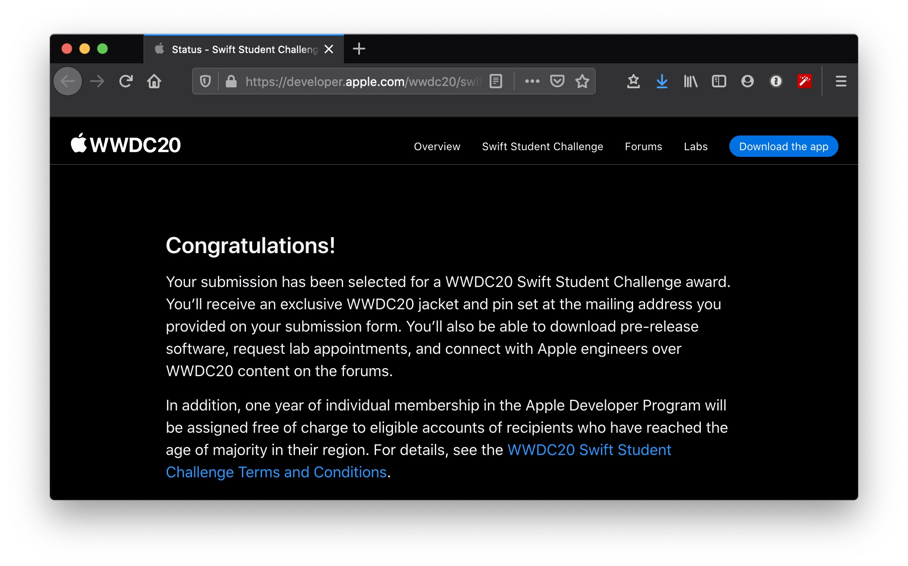

# Apple WWDC Student Scholarship

Apple 每年会在 6 月份举办 WWDC，为了鼓励学生开发者，Apple 会在 3 月（2020 因为疫情在 5 月）举办 WWDC Student Scholarship （ 今年叫 WWDC Student Swift Challenge）。每年会从全球的学生开发者作品中选出 350 左右的学生开发者作为获奖者。Apple 会支持获奖者前往美国参会（包括机票、食宿、门票）。

## 比赛形式

Apple 每年会在每年三月（2020年在 5月）在官网发布比赛通知，会要求开发者在 10 天左右的时间在 Playground 上使用 Swift 完成一个作品。每年的规则在大体上都是一样的，所以完全可以提前准备好你的作品。

## 规则

这个比赛的规则就是 **没有规则** 。Apple 会限制你的作品的大小、不能联网、语言（英语）以及版权相关的一些琐碎的细节，同时要求你的作品能够在数分钟内能够体验完成，但是对于你的作品的主题，Apple 完全没有规定。

### 大致规则

Apple 比赛介绍上一般都会说从 **创意**、**技术**、**其他材料** 三个方面来评审你的作品，但是没有具体说明比重和要求。

### 提交

我们需要在 DDL 之前来在比赛网站上面提交我们的作品，并且添加一些描述文字（英语），比如你的作品有什么功能，使用了什么技术，或者你学习编程的故事和经验等等。

### 提交之后

提交之后就是等待。Apple 会通过邮件的方式来告之你是否获奖。可能会有 Apple 各方的工作人员（Newsroom、微信等等）联系你进行采访。

往年会要请你参加 WWDC 线下会议，但是 2020 年，Apple 线上举行 WWDC，获奖者拿到了来着 Apple 的纪念品。

## Tips

在我浏览了大量的 Accepted 作品之后我个人总结出了以下的一些 Tips：

* **创意比技术更重要：** Apple 更加注重的可能是学生开发者的创意。在大量作品中，有不少很复杂、高级的作品，但是没有获奖。但是也有很多功能简单，但是会让人眼前一亮，很有创意的作品被 Accepted。有一个好的创意，会让你在比赛中占据上风。
* **尝试用 Apple 的新技术：**Apple 在往年的 WWDC 中会释放出大量的新技术，比如这两年 Apple 在不断维护的 `Swift UI` 和 AI 相关的一些功能。但是也不要为了用新技术而用新技术，否则会适得其反。
* **释放你的设备的功能：**不管你使用的是 iPad 还是 Mac 来完成你的作品，尝试用一下这些设备中特有的功能。比如 iPad 的 AR 和 MacBook 的 Touch Bar。
* **用 Apple 的思维：**在设计你的作品的过程中，可以用 Apple 的思维来思考。尝试去阅读一些 Apple 的设计文档，用 Apple 的思维去思考。比如 Apple 不希望开发者在 Touch Bar 上面实现一些复杂的功能，而是希望开发者将 Touch Bar 作为键盘的一种辅助，避免在没有 Touch Bar 的 Mac 上这个软件不能被使用。Apple 提供了设计文档，我们在构思项目之前可以先阅读一番。

除此之外还有一个国内学生开发者的 QQ 群，里面有很多往年的获奖者，也有 Apple 的工作人员，会有很多经验的分享。

> QQ群号：612713009

## 其他资源

* [WWDC Scholarship 指南](http://pjhubs.com/2020/02/12/wwdcscholar/)：19 年获奖者撰写的指南。
* [Human Interface Guidelines](https://developer.apple.com/design/human-interface-guidelines/)：Apple 官方 UI 设计指南。
* [斯坦福大学推出了基于 SwiftUI 的 iOS 编程课](https://www.bilibili.com/video/BV1EV411C77B?from=search&seid=14026600158556857484)：B 站搬运课程。
* [WWDC Students](https://github.com/wwdc)：每年获奖作品的合集，某些作品还带有视频演示，可以在里面找到灵感。
* [WWDC20 Swift Student Challenge](https://developer.apple.com/wwdc20/swift-student-challenge/)：WWDC20 Swift Student Challenge 官网。
